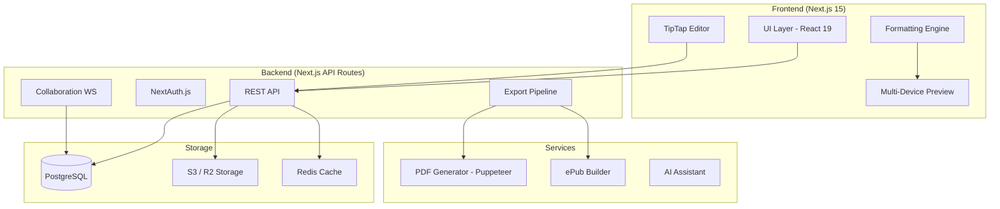
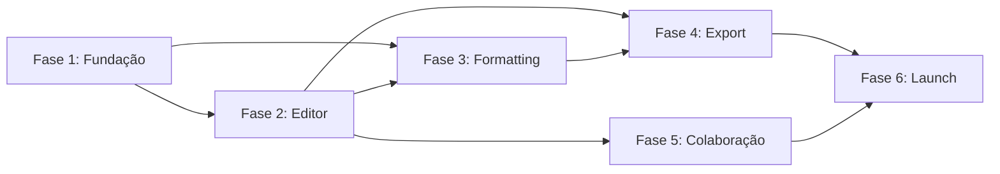

# 🚀 Kroj — Plano de Implementação Premium

> **Projeto:** Kroj — Plataforma de Editoração de Livros  
> **Baseline:** Atticus.io (63 features mapeadas)  
> **Objetivo:** Replicar + Superar o Atticus com inovações premium  
> **Repo:** [ctoutbank/kroj](https://github.com/ctoutbank/kroj)

---

## 📐 Arquitetura de Alto Nível

## 🛠 Stack Tecnológico

| Camada | Tecnologia | Justificativa |
|--------|-----------|---------------|
| **Framework** | Next.js 15 (App Router) | SSR, API routes, incremental builds |
| **UI** | React 19 + Radix UI | Components primitivos, acessíveis |
| **Styling** | Tailwind CSS v4 | Design tokens, utility-first |
| **Editor** | TipTap v2 (ProseMirror) | Extensível, schema customizável, colaboração |
| **State** | Zustand | Leve, sem boilerplate |
| **DB** | PostgreSQL + Prisma | Schema tipado, migrations |
| **Auth** | NextAuth.js v5 | OAuth, magic link, session |
| **Storage** | Cloudflare R2 / AWS S3 | Imagens, capas, exports |
| **PDF** | Puppeteer + Paged.js | Print-ready PDF com CSS Paged Media |
| **ePub** | epub-gen-memory | Geração server-side |
| **Realtime** | Yjs + Hocuspocus | CRDT para colaboração |
| **Cache** | Redis (Upstash) | Sessions, locks, queue |
| **Deploy** | Vercel | Edge functions, CDN global |
| **Monitoramento** | Sentry + Vercel Analytics | Errors, performance |

---

## 📅 Fases de Implementação

---

### 🏗 FASE 1 — FUNDAÇÃO (Sprints 1–4)

> **Objetivo:** Infraestrutura, auth, projeto CRUD, design system base

---

#### Sprint 1: Scaffolding & Design System (Semana 1–2)

| # | Tarefa | Prioridade | Estimativa | Dependências |
|---|--------|-----------|------------|--------------|
| 1.1.1 | Inicializar Next.js 15 com App Router + TypeScript strict | P0 | 2h | — |
| 1.1.2 | Configurar Tailwind v4 com design tokens (cores, tipografia, spacing) | P0 | 4h | 1.1.1 |
| 1.1.3 | Instalar e configurar Radix UI primitives (Dialog, Dropdown, Tabs, Tooltip, Toggle) | P0 | 3h | 1.1.1 |
| 1.1.4 | Criar componentes base: Button, Input, Select, Slider, Toggle, Badge, Card | P0 | 8h | 1.1.2, 1.1.3 |
| 1.1.5 | Implementar tema Light/Dark com CSS variables e toggle | P1 | 4h | 1.1.2 |
| 1.1.6 | Configurar ESLint + Prettier + Husky (pre-commit) | P0 | 2h | 1.1.1 |
| 1.1.7 | Setup Prisma + PostgreSQL (schema inicial) | P0 | 4h | 1.1.1 |
| 1.1.8 | Configurar Sentry error tracking + Vercel Analytics | P2 | 2h | 1.1.1 |

**Entregável:** Projeto funcional com design system base e banco configurado

---

#### Sprint 2: Autenticação & Perfil (Semana 3–4)

| # | Tarefa | Prioridade | Estimativa | Dependências |
|---|--------|-----------|------------|--------------|
| 1.2.1 | Implementar NextAuth.js v5 (Email/Password + Google OAuth) | P0 | 6h | 1.1.7 |
| 1.2.2 | Criar tela de Sign In (formulário, validação, SSO buttons) | P0 | 4h | 1.2.1 |
| 1.2.3 | Criar tela de Sign Up com onboarding | P0 | 4h | 1.2.1 |
| 1.2.4 | Implementar fluxo de recuperação de senha | P1 | 3h | 1.2.1 |
| 1.2.5 | Criar página My Account (nome, email, website, avatar upload) | P1 | 4h | 1.2.1 |
| 1.2.6 | Implementar página de Preferences (tema, idioma padrão) | P2 | 2h | 1.2.5 |
| 1.2.7 | Middleware de proteção de rotas | P0 | 2h | 1.2.1 |
| 1.2.8 | Modelo Prisma: User, Account, Session | P0 | 2h | 1.1.7 |

**Entregável:** Sistema de auth completo com login, cadastro, perfil

---

#### Sprint 3: CRUD de Projetos (Semana 5–6)

| # | Tarefa | Prioridade | Estimativa | Dependências |
|---|--------|-----------|------------|--------------|
| 1.3.1 | Modelo Prisma: Book (title, subtitle, author, language, cover, metadata) | P0 | 3h | 1.2.8 |
| 1.3.2 | Modelo Prisma: Chapter (title, type, content, order, settings) | P0 | 3h | 1.3.1 |
| 1.3.3 | API: CRUD de livros (`/api/books`) | P0 | 4h | 1.3.1 |
| 1.3.4 | API: CRUD de capítulos (`/api/books/[id]/chapters`) | P0 | 4h | 1.3.2 |
| 1.3.5 | API: Upload de capa (S3/R2 integration) | P1 | 4h | 1.3.1 |
| 1.3.6 | API: Reordenação de capítulos (drag-and-drop backend) | P0 | 3h | 1.3.4 |
| 1.3.7 | API: Import DOCX → Chapters (mammoth.js) | P1 | 6h | 1.3.4 |
| 1.3.8 | Modelo Prisma: BookVersion (snapshots) | P2 | 2h | 1.3.1 |

**Entregável:** Backend completo para gestão de livros e capítulos

---

#### Sprint 4: Dashboard & Project Management UI (Semana 7–8)

| # | Tarefa | Prioridade | Estimativa | Dependências |
|---|--------|-----------|------------|--------------|
| 1.4.1 | Layout principal: Header (logo, nav tabs, user menu) | P0 | 4h | 1.1.4 |
| 1.4.2 | Home Dashboard: quick action cards (Upload, New Book, Boxset) | P0 | 4h | 1.4.1 |
| 1.4.3 | Home Dashboard: Recent Work carousel com book cards | P0 | 4h | 1.3.3 |
| 1.4.4 | My Books: grid/list toggle, search, sort, tabs (All/Books/Master Pages) | P0 | 6h | 1.3.3 |
| 1.4.5 | Book card component (capa, título, autor, data, menu ⋮) | P0 | 3h | 1.1.4 |
| 1.4.6 | Ações de book card: Duplicate, Delete (com confirmação) | P1 | 3h | 1.4.5, 1.3.3 |
| 1.4.7 | Diálogo "New Book": campos (título, autor, tipo, idioma) | P0 | 4h | 1.3.3 |
| 1.4.8 | Diálogo "Upload Book": drag-and-drop DOCX + progress bar | P1 | 4h | 1.3.7 |
| 1.4.9 | Empty states com citações literárias (como Atticus) | P2 | 2h | — |

**Entregável:** Dashboard funcional com gestão visual de projetos

---

### ✍️ FASE 2 — EDITOR CORE (Sprints 5–8)

> **Objetivo:** Editor WYSIWYG completo com toolbar, capítulos e ferramentas de escrita

---

#### Sprint 5: TipTap Editor Foundation (Semana 9–10)

| # | Tarefa | Prioridade | Estimativa | Dependências |
|---|--------|-----------|------------|--------------|
| 2.5.1 | Instalar TipTap v2 + extensões (StarterKit, Placeholder, CharacterCount) | P0 | 3h | — |
| 2.5.2 | Layout do editor: 3-panel (sidebar, editor, tools) | P0 | 6h | 1.4.1 |
| 2.5.3 | Writing/Formatting mode toggle (top bar) | P0 | 3h | 2.5.2 |
| 2.5.4 | Toolbar: Bold, Italic, Underline | P0 | 2h | 2.5.1 |
| 2.5.5 | Toolbar: Strikethrough, Monospace, SmallCaps, Sans Serif (extensões custom) | P0 | 4h | 2.5.1 |
| 2.5.6 | Toolbar: Subscript, Superscript | P0 | 2h | 2.5.1 |
| 2.5.7 | Toolbar: Headings dropdown (¶ → H2–H6) | P0 | 3h | 2.5.1 |
| 2.5.8 | Toolbar: Alignment (Left, Center, Right, Justified) | P0 | 2h | 2.5.1 |

**Entregável:** Editor funcional com formatação inline completa

---

#### Sprint 6: Toolbar Avançado & Inserções (Semana 11–12)

| # | Tarefa | Prioridade | Estimativa | Dependências |
|---|--------|-----------|------------|--------------|
| 2.6.1 | Extensão TipTap: Scene Break (separador de cena com customização) | P0 | 4h | 2.5.1 |
| 2.6.2 | Toolbar: Listas (ordered, unordered) com nesting | P0 | 3h | 2.5.1 |
| 2.6.3 | Toolbar: Hyperlinks (inserir, editar, remover) | P0 | 3h | 2.5.1 |
| 2.6.4 | Toolbar: Image insertion (upload to S3, resize, alignment) | P0 | 6h | 2.5.1, 1.3.5 |
| 2.6.5 | Toolbar: Blockquote / Callout (estilo visual) | P1 | 3h | 2.5.1 |
| 2.6.6 | Toolbar: Indent / Outdent | P0 | 2h | 2.5.1 |
| 2.6.7 | Toolbar: Undo / Redo | P0 | 1h | 2.5.1 |
| 2.6.8 | Toolbar: Fullscreen toggle | P1 | 2h | 2.5.2 |
| 2.6.9 | Footnotes extension (inline note markers) | P1 | 5h | 2.5.1 |

**Entregável:** Toolbar completo com todas as ferramentas de inserção

---

#### Sprint 7: Chapter Management (Semana 13–14)

| # | Tarefa | Prioridade | Estimativa | Dependências |
|---|--------|-----------|------------|--------------|
| 2.7.1 | Left sidebar: chapter list com ícones de tipo | P0 | 4h | 2.5.2 |
| 2.7.2 | Front Matter types: Title Page, Copyright, Contents | P0 | 4h | 2.7.1 |
| 2.7.3 | Back Matter types: About Author, Also By, Glossary | P1 | 3h | 2.7.1 |
| 2.7.4 | Drag-and-drop reordenação (dnd-kit) | P0 | 4h | 2.7.1 |
| 2.7.5 | Add chapter: botão + diálogo com tipo (chapter, front, back) | P0 | 3h | 2.7.1 |
| 2.7.6 | Delete chapter com confirmação | P0 | 2h | 2.7.1 |
| 2.7.7 | Chapter header: title field, subtitle field, chapter image | P0 | 4h | 2.5.2 |
| 2.7.8 | Chapter settings gear (⚙): toggles para heading, page numbers, header/footer, TOC visibility, first sentence, invert color | P1 | 4h | 2.7.7 |
| 2.7.9 | Copyright templates (preset legal texts) | P2 | 3h | 2.7.2 |
| 2.7.10 | Full page image chapter type | P2 | 3h | 2.7.1 |

**Entregável:** Gestão completa de capítulos com front/back matter

---

#### Sprint 8: Writing Tools & Bottom Bar (Semana 15–16)

| # | Tarefa | Prioridade | Estimativa | Dependências |
|---|--------|-----------|------------|--------------|
| 2.8.1 | Right sidebar: Typography panel (font, size, line-height, paragraph style) | P1 | 4h | 2.5.2 |
| 2.8.2 | Right sidebar: Find & Replace (scope, match case, whole word) | P0 | 5h | 2.5.1 |
| 2.8.3 | Right sidebar: Goals panel (word count goal, due date, weekly schedule) | P2 | 4h | 2.5.2 |
| 2.8.4 | Right sidebar: Smart Quotes converter + inconsistency checker | P2 | 5h | 2.5.1 |
| 2.8.5 | Bottom bar: word count (chapter + book toggle) | P0 | 3h | 2.5.1 |
| 2.8.6 | Bottom bar: writing timer (start/pause/reset) | P2 | 3h | — |
| 2.8.7 | Bottom bar: quick export docx | P1 | 3h | — |
| 2.8.8 | Auto-save com debounce (cloud sync indicator) | P0 | 4h | 1.3.4 |

**Entregável:** Editor completo com todas as ferramentas auxiliares

---

### 🎨 FASE 3 — ENGINE DE FORMATAÇÃO (Sprints 9–14)

> **Objetivo:** Sistema de temas, preview multi-dispositivo, e configuração visual completa. **Esta é a fase mais crítica.**

---

#### Sprint 9: Theme System Foundation (Semana 17–18)

| # | Tarefa | Prioridade | Estimativa | Dependências |
|---|--------|-----------|------------|--------------|
| 3.9.1 | Modelo Prisma: Theme (name, config JSON, user_id, is_default) | P0 | 3h | 1.1.7 |
| 3.9.2 | Schema TypeScript para ThemeConfig (todos os 9 sections como tipos) | P0 | 6h | — |
| 3.9.3 | API: CRUD de temas (`/api/themes`) | P0 | 4h | 3.9.1 |
| 3.9.4 | 18 temas built-in como seed data (JSON configs) | P0 | 8h | 3.9.2 |
| 3.9.5 | Formatting mode: layout (sidebar sections + preview area) | P0 | 6h | 2.5.3 |
| 3.9.6 | Theme gallery: grid de cards com preview thumbnail | P0 | 4h | 3.9.5 |
| 3.9.7 | Theme selection: apply com preview instantâneo | P0 | 3h | 3.9.6 |
| 3.9.8 | "Create new theme" flow com discard/save | P1 | 4h | 3.9.3 |

**Entregável:** Sistema de temas funcional com 18 temas built-in

---

#### Sprint 10: Chapter Heading Config (Semana 19–20)

| # | Tarefa | Prioridade | Estimativa | Dependências |
|---|--------|-----------|------------|--------------|
| 3.10.1 | UI: Chapter number view selector (1, Chapter 1, One, Chapter One) | P0 | 3h | 3.9.5 |
| 3.10.2 | UI: Chapter title toggle + Font/Align/Style/Size/Width controls | P0 | 6h | 3.9.5 |
| 3.10.3 | UI: Chapter subtitle toggle + Font/Align/Style/Width controls | P0 | 4h | 3.10.2 |
| 3.10.4 | UI: Chapter image toggle + upload | P1 | 3h | 3.10.2 |
| 3.10.5 | Font picker component (dropdown com preview visual de cada fonte) | P0 | 5h | — |
| 3.10.6 | Size slider component (reusável, com range e step) | P0 | 2h | — |
| 3.10.7 | Rendering engine: chapter heading → CSS/HTML template | P0 | 6h | 3.10.2 |

**Entregável:** Configuração completa de chapter headings com preview live

---

#### Sprint 11: Paragraph, Drop Caps & Scene Breaks (Semana 21–22)

| # | Tarefa | Prioridade | Estimativa | Dependências |
|---|--------|-----------|------------|--------------|
| 3.11.1 | UI: First sentence (Drop Caps / Lead-in Small Caps / None) | P0 | 4h | 3.9.5 |
| 3.11.2 | Drop cap font picker (fontes decorativas) | P0 | 3h | 3.10.5 |
| 3.11.3 | Drop cap rendering engine (CSS initial-letter + fallback) | P0 | 5h | 3.11.1 |
| 3.11.4 | UI: Subsequent paragraphs (Indented / Spaced) | P0 | 2h | 3.9.5 |
| 3.11.5 | UI: Subheading config (H2–H6 font + size multiplier) | P1 | 4h | 3.10.5 |
| 3.11.6 | UI: Scene break options (image / text / none) | P0 | 3h | 3.9.5 |
| 3.11.7 | Scene break image gallery + upload | P1 | 4h | 3.11.6 |
| 3.11.8 | Scene break width slider + rendering | P0 | 3h | 3.11.6 |

**Entregável:** Parágrafos, drop caps e scene breaks configuráveis

---

#### Sprint 12: Typography, Notes & Print Layout (Semana 23–24)

| # | Tarefa | Prioridade | Estimativa | Dependências |
|---|--------|-----------|------------|--------------|
| 3.12.1 | UI: Body font selection (15+ fontes profissionais) | P0 | 4h | 3.10.5 |
| 3.12.2 | UI: Font size slider (9pt–18pt) | P0 | 2h | 3.10.6 |
| 3.12.3 | UI: Line spacing slider (1.0–2.0 com presets) | P0 | 2h | 3.10.6 |
| 3.12.4 | UI: Large print toggle | P1 | 1h | — |
| 3.12.5 | UI: Notes positioning (PDF: footnote/end-chapter/end-book; ePub: end-chapter/end-book) | P0 | 4h | 3.9.5 |
| 3.12.6 | UI: Footnote font size slider | P1 | 2h | 3.10.6 |
| 3.12.7 | UI: Print layout (units in/mm, inside/outside margins, hanging indent) | P0 | 5h | 3.9.5 |
| 3.12.8 | UI: Justified text + Hyphenation toggles | P0 | 2h | — |
| 3.12.9 | UI: Layout priority (Widows & Orphans / Balanced / Hybrid) | P1 | 3h | — |

**Entregável:** Typography completa, notas e print layout configuráveis

---

#### Sprint 13: Header/Footer & Trim Sizes (Semana 25–26)

| # | Tarefa | Prioridade | Estimativa | Dependências |
|---|--------|-----------|------------|--------------|
| 3.13.1 | UI: Header/Footer layout presets (visual selector) | P0 | 6h | 3.9.5 |
| 3.13.2 | Header variables: page number, book title, author name, chapter title | P0 | 4h | 3.13.1 |
| 3.13.3 | Mirrored (even/odd) page headers | P0 | 3h | 3.13.1 |
| 3.13.4 | Header/Footer font + size controls | P1 | 3h | 3.10.5 |
| 3.13.5 | UI: Trim sizes catalog (trade, international, mass market, children's, custom) | P0 | 5h | 3.9.5 |
| 3.13.6 | Custom trim size input (W × H com validação) | P1 | 3h | 3.13.5 |
| 3.13.7 | Trim size → margin auto-calculation | P1 | 3h | 3.13.5, 3.12.7 |

**Entregável:** Headers/footers e trim sizes completos

---

#### Sprint 14: Multi-Device Preview Engine (Semana 27–28)

| # | Tarefa | Prioridade | Estimativa | Dependências |
|---|--------|-----------|------------|--------------|
| 3.14.1 | Preview renderer: theme config → CSS → live HTML preview | P0 | 8h | 3.9.2 |
| 3.14.2 | Device frame components (iPhone, iPad, Galaxy Tab, Galaxy S21, Kindle Fire/Paperwhite/Oasis, Print) | P0 | 6h | 3.14.1 |
| 3.14.3 | Device size dropdown selector | P0 | 2h | 3.14.2 |
| 3.14.4 | Preview font dropdown (Palatino, Georgia, etc.) | P0 | 2h | 3.14.1 |
| 3.14.5 | Font size slider no preview | P1 | 2h | 3.14.1 |
| 3.14.6 | Chapter navigation no preview (← Chapter / Chapter →) | P0 | 3h | 3.14.1 |
| 3.14.7 | Print preview: realistic page spread (folha A4/trade) | P1 | 5h | 3.14.1 |
| 3.14.8 | Responsive preview frame (redimensiona com viewport) | P1 | 3h | 3.14.2 |

**Entregável:** Preview multi-dispositivo com rendering em tempo real

---

### 📤 FASE 4 — EXPORT PIPELINE (Sprints 15–17)

> **Objetivo:** Exportação profissional para ePub, PDF print-ready e docx

---

#### Sprint 15: ePub Export (Semana 29–30)

| # | Tarefa | Prioridade | Estimativa | Dependências |
|---|--------|-----------|------------|--------------|
| 4.15.1 | ePub builder service (content → XHTML → epub-gen) | P0 | 8h | — |
| 4.15.2 | Theme → ePub CSS transformer | P0 | 6h | 3.9.2 |
| 4.15.3 | Cover image embedding | P0 | 3h | 4.15.1 |
| 4.15.4 | Table of Contents generation (NCX + nav) | P0 | 4h | 4.15.1 |
| 4.15.5 | Metadata embedding (title, author, ISBN, language) | P0 | 3h | 4.15.1 |
| 4.15.6 | Image optimization + embedding | P1 | 3h | 4.15.1 |
| 4.15.7 | Font embedding (subset) | P1 | 4h | 4.15.1 |

**Entregável:** Exportação ePub funcional e válida (epubcheck)

---

#### Sprint 16: PDF Print-Ready Export (Semana 31–32)

| # | Tarefa | Prioridade | Estimativa | Dependências |
|---|--------|-----------|------------|--------------|
| 4.16.1 | PDF generator service (Puppeteer + Paged.js) | P0 | 8h | — |
| 4.16.2 | Theme → CSS Paged Media transformer | P0 | 8h | 3.9.2 |
| 4.16.3 | Page size / trim size mapping | P0 | 3h | 3.13.5 |
| 4.16.4 | Headers/Footers rendering (CSS @page) | P0 | 5h | 3.13.1 |
| 4.16.5 | Drop caps rendering (print CSS) | P1 | 3h | 3.11.3 |
| 4.16.6 | Widows & Orphans CSS control | P0 | 3h | 3.12.9 |
| 4.16.7 | Background processing queue (job status, notification) | P0 | 5h | — |
| 4.16.8 | PDF download + notification system | P0 | 3h | 4.16.7 |

**Entregável:** PDF print-ready com qualidade profissional

---

#### Sprint 17: DOCX Export & Book Details (Semana 33–34)

| # | Tarefa | Prioridade | Estimativa | Dependências |
|---|--------|-----------|------------|--------------|
| 4.17.1 | DOCX export service (docx.js) | P0 | 6h | — |
| 4.17.2 | Theme → Word styles mapping | P1 | 4h | 3.9.2 |
| 4.17.3 | Quick export button (bottom bar) | P0 | 2h | 4.17.1 |
| 4.17.4 | Book Details page: metadata form (title, subtitle, author, project, version, language, start page) | P0 | 5h | 1.3.1 |
| 4.17.5 | Publisher Details tab (publisher name, link, ISBNs, logo) | P1 | 4h | 4.17.4 |
| 4.17.6 | Book Statistics card (chapters count, word count) | P1 | 2h | 4.17.4 |
| 4.17.7 | Export center: 3 botões (ePub/PDF/docx) com status | P0 | 4h | 4.15.1, 4.16.1, 4.17.1 |
| 4.17.8 | Snapshots: download de backup (JSON) | P2 | 3h | 1.3.8 |

**Entregável:** Exportação completa + gestão de metadados

---

### 👥 FASE 5 — COLABORAÇÃO & FERRAMENTAS (Sprints 18–20)

> **Objetivo:** Colaboração em tempo real, comentários, track changes

---

#### Sprint 18: Colaboração Core (Semana 35–36)

| # | Tarefa | Prioridade | Estimativa | Dependências |
|---|--------|-----------|------------|--------------|
| 5.18.1 | Setup Yjs + Hocuspocus server | P1 | 6h | — |
| 5.18.2 | TipTap Collaboration extension (cursor awareness) | P1 | 5h | 5.18.1 |
| 5.18.3 | Invite system: generate link, set permissions (view/edit/comment) | P1 | 5h | 1.2.1 |
| 5.18.4 | UI: Invite modal com copy link | P1 | 3h | 5.18.3 |
| 5.18.5 | Collaboration tab na dashboard | P2 | 3h | 5.18.3 |

---

#### Sprint 19: Comments & Track Changes (Semana 37–38)

| # | Tarefa | Prioridade | Estimativa | Dependências |
|---|--------|-----------|------------|--------------|
| 5.19.1 | Comments system (inline text selection → comment) | P1 | 6h | 5.18.2 |
| 5.19.2 | Comments panel (right sidebar): list, filter, resolve | P1 | 5h | 5.19.1 |
| 5.19.3 | @ Mentions (TipTap extension → notify collaborator) | P2 | 4h | 5.18.2 |
| 5.19.4 | Track Changes: suggest mode (insert/delete tracking) | P2 | 8h | 5.18.2 |
| 5.19.5 | Accept/Reject changes UI | P2 | 4h | 5.19.4 |

---

#### Sprint 20: 🚀 Inovações Premium (Semana 39–40)

| # | Tarefa | Prioridade | Estimativa | Dependências |
|---|--------|-----------|------------|--------------|
| 5.20.1 | **AI Writing Assistant**: sugestões inline, continuação de texto, reformulação | P1 | 8h | 2.5.1 |
| 5.20.2 | **Analytics de Escrita**: dashboard com produtividade, legibilidade (Flesch), frequência de palavras | P2 | 6h | 2.8.5 |
| 5.20.3 | **Template Marketplace**: upload/download de temas (community) | P2 | 8h | 3.9.3 |
| 5.20.4 | **Publicação Direta**: KDP upload via API (futurístico) | P3 | — | 4.15.1, 4.16.1 |
| 5.20.5 | **Mobile Responsive**: adaptação do editor para tablet/mobile | P2 | 8h | 2.5.2 |

**Entregável:** Features que diferenciam o Kroj do Atticus

---

### 🏁 FASE 6 — POLISH & LAUNCH (Sprints 21–24)

> **Objetivo:** Qualidade, performance, SEO, acessibilidade, deploy

---

#### Sprint 21: Performance & Optimization (Semana 41–42)

| # | Tarefa | Prioridade | Estimativa | Dependências |
|---|--------|-----------|------------|--------------|
| 6.21.1 | Code splitting e lazy loading de módulos pesados (editor, formatter) | P0 | 4h | — |
| 6.21.2 | Image optimization (next/image, WebP, lazy) | P0 | 3h | — |
| 6.21.3 | Editor performance: virtualização para capítulos longos | P1 | 6h | 2.5.1 |
| 6.21.4 | Database query optimization (indexes, n+1 prevention) | P0 | 4h | 1.1.7 |
| 6.21.5 | Redis caching para sessões e locks de edição | P1 | 4h | — |
| 6.21.6 | Bundle analysis e tree-shaking | P1 | 3h | — |

---

#### Sprint 22: Testing & Quality (Semana 43–44)

| # | Tarefa | Prioridade | Estimativa | Dependências |
|---|--------|-----------|------------|--------------|
| 6.22.1 | Unit tests: theme engine, export services, utils | P0 | 8h | — |
| 6.22.2 | Integration tests: API routes (books, chapters, themes) | P0 | 6h | — |
| 6.22.3 | E2E tests: Playwright (login, create book, edit, export) | P0 | 8h | — |
| 6.22.4 | Visual regression tests: theme previews | P1 | 4h | — |
| 6.22.5 | Accessibility audit (WCAG 2.1 AA) | P1 | 4h | — |
| 6.22.6 | Security audit: auth, input sanitization, S3 policies | P0 | 4h | — |

---

#### Sprint 23: SEO & Documentation (Semana 45–46)

| # | Tarefa | Prioridade | Estimativa | Dependências |
|---|--------|-----------|------------|--------------|
| 6.23.1 | Landing page / marketing site (SSG) | P1 | 8h | — |
| 6.23.2 | SEO: meta tags, OG images, structured data | P1 | 4h | 6.23.1 |
| 6.23.3 | Help center / documentação (Notion / Mintlify) | P2 | 6h | — |
| 6.23.4 | Onboarding tutorial flow (first-time user) | P1 | 5h | — |
| 6.23.5 | README + Contributing guide | P2 | 3h | — |

---

#### Sprint 24: Deploy & Launch (Semana 47–48)

| # | Tarefa | Prioridade | Estimativa | Dependências |
|---|--------|-----------|------------|--------------|
| 6.24.1 | Vercel production deploy + custom domain | P0 | 3h | — |
| 6.24.2 | Database migration (prod) + seed data (themes) | P0 | 3h | — |
| 6.24.3 | S3/R2 production bucket + CORS config | P0 | 2h | — |
| 6.24.4 | Hocuspocus production deploy (collaboration server) | P1 | 3h | — |
| 6.24.5 | Monitoring: Sentry alerts, uptime checks | P0 | 2h | — |
| 6.24.6 | CI/CD pipeline (GitHub Actions: lint, test, deploy) | P0 | 4h | — |
| 6.24.7 | Load testing (k6) — 100 concurrent users | P1 | 3h | — |
| 6.24.8 | Beta launch + feedback loop | P0 | — | — |

---

## 📊 Resumo de Estimativas

| Fase | Sprints | Semanas | Horas Est. |
|------|---------|---------|------------|
| 1. Fundação | 4 | 8 | ~120h |
| 2. Editor Core | 4 | 8 | ~130h |
| 3. Formatting Engine | 6 | 12 | ~190h |
| 4. Export Pipeline | 3 | 6 | ~85h |
| 5. Colaboração & Inovações | 3 | 6 | ~90h |
| 6. Polish & Launch | 4 | 8 | ~105h |
| **TOTAL** | **24** | **48** | **~720h** |

---

## ✅ Plano de Verificação

### Testes Automatizados

| Tipo | Ferramenta | Escopo | Comando |
|------|-----------|--------|---------|
| Unit | Vitest | Theme engine, utils, services | `npm run test:unit` |
| Integration | Vitest + Supertest | API routes | `npm run test:integration` |
| E2E | Playwright | User flows completos | `npm run test:e2e` |
| Visual | Playwright + argos-ci | Theme previews | `npm run test:visual` |

### Verificações Manuais

1. **Export Quality**: Gerar ePub e validar com epubcheck; gerar PDF e comparar com Atticus
2. **Print Fidelity**: Upload PDF no KDP Preview Tool para verificar trim sizes e margens
3. **Cross-Device**: Testar preview em dispositivos reais (iPhone, Kindle Paperwhite)
4. **Accessibility**: Lighthouse accessibility score ≥ 90
5. **Performance**: Lighthouse performance score ≥ 85 no editor

---

## 🗺 Dependências Críticas

> [!IMPORTANT]
> A **Fase 3 (Formatting Engine)** é a maior e mais complexa. Ela depende da Fase 2 (editor funcional) e é pré-requisito para a Fase 4 (export). Priorize os Sprints 9–14 para evitar bloqueios no pipeline de exportação.
